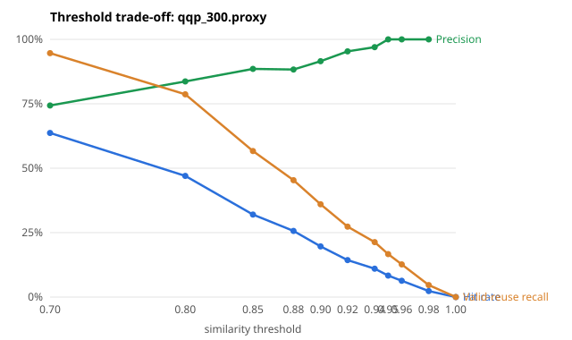

# CacheMind

**A provider-agnostic semantic cache for OpenAI-compatible LLM APIs, with a measured latency / cost / correctness trade-off.**

A semantic cache reuses a stored LLM answer when a new request is *similar enough* to an earlier one (by embedding similarity), not only when the text is identical, which saves provider latency and cost.
The risk is serving a wrong answer to a request that only looks similar. CacheMind sits in front of an OpenAI-compatible API as a proxy and treats that risk as the thing to measure.

Built and measured against `openai/gpt-4.1-mini` via OpenRouter. On a real 165-request benchmark the cache
**avoided 63.0% of provider calls (66.9% estimated net cost saving, embedding cost included)**, with
**cache-hit P50 1.4 ms vs a 978 ms direct provider P50**, and none of the 104 hits was a wrong answer.

**The honest headline is narrower than that.** All 104 hits were *exact* repeats, so "0 wrong hits" says nothing about semantic
matching; none of the 8 paraphrase requests hit at threshold 0.95 (their highest similarity was 0.941). In a 2,000-request simulation on real question data, semantic matching added only
**+0.17 percentage points** of hit rate over exact matching at 0.95, and false hits rose to 1.9% of hits when
the threshold was dropped to 0.80. On adversarial near-duplicates (PAWS) embeddings cannot separate right from wrong
reuse at any threshold below 1.0. Details, caveats and what did not work are below.

> Central question: *how much latency and cost can semantic caching remove while preserving response correctness?*
> Answer on this workload: a lot from exact repeats, very little extra from semantic matching, and the
> extra is where the false hits are.

Every number below comes from a saved report in [evals/results/](evals/results/): JSON reports, Markdown tables
([summary](evals/results/summary.md)) and SVG threshold curves. Paid steps were capped by a spend ledger and embeddings were cached
on disk, so the experiments are cheap to rerun ("Reproducing the results" below).

## Quickstart

Prerequisites: [uv](https://docs.astral.sh/uv/) and Python 3.11 or 3.12 (only 3.12 has been exercised). An OpenRouter API key is needed only to send real requests; the first three commands below need none and cost nothing.

```bash
uv sync                                  # project venv only (add --extra redis for the Redis backend)
uv run pytest                            # 140 passed, 2 skipped without the redis extra; 150 passed, 1 skipped with it (the skip is the live Redis test)
uv run python scripts/demo_offline.py    # $0, no key: HIT/MISS, identity isolation, bypass and invalidation over HTTP with a fake provider
cp .env.example .env                     # then put your OpenRouter key in .env (never commit it)
uv run --env-file .env uvicorn semantic_cache.api.main:create_configured_app --factory   # proxy on http://localhost:8000
```

The offline demo prints:

```text
step                                                 X-Cache  provider calls so far
first request                                        MISS     1
identical request                                    HIT      1
temperature 0.7 (different identity)                 MISS     2
different system prompt                              MISS     3
Cache-Control: no-store                              BYPASS   4
admin invalidation by model (removed 3 entries)      -        4
identical request after invalidation                 MISS     5
```

With the server running, send a real request (costs a fraction of a cent; `-i` shows the `X-Cache` header):

```bash
curl -si localhost:8000/v1/chat/completions -H 'content-type: application/json' \
  -d '{"model":"openai/gpt-4.1-mini","temperature":0,"max_tokens":150,"messages":[{"role":"user","content":"What is the capital of France?"}]}' | grep -i x-cache
# 1st call: X-Cache: MISS (~1 s, goes to the provider, response stored)
# 2nd identical call: X-Cache: HIT (~2 ms)
# add -H 'Cache-Control: no-store' for X-Cache: BYPASS
```

## Results

### 1. Real end-to-end benchmark (165 requests)

Real provider, real embeddings, localhost HTTP, in-memory store, threshold 0.95, guard on, seed 42.
Each request is sent both directly to the provider and through the proxy (order alternates per request).
[Report](evals/results/e2e-real-benchmark.json).

| Path | n | P50 ms | P95 ms | P99 ms |
|---|---:|---:|---:|---:|
| direct provider | 165 | 978.2 | 1437.1 | 1602.1 |
| proxy HIT | 104 | 1.4 | 2.1 | 2.3 |
| proxy MISS | 46 | 1127.8 | 1483.6 | 1840.1 |
| proxy BYPASS (`no-store`) | 15 | 1020.7 | 1414.1 | 1414.1 |

- Provider calls: 165 direct vs 61 via proxy (104 avoided, 63.0%).
- HIT validity (intent oracle): 104 valid, 0 false.
- Estimated cost at configured prices: direct $0.01811 vs proxy $0.00600, **66.9% net saving**.
- Median paired overhead of a MISS vs the same request sent directly: **+232 ms** (embedding + lookup + store).

**Caveats.** One run, one seed; P95/P99 rest on few samples (46 misses, 15 bypasses). An earlier attempt hit the provider's credit limit at request 99 (from there on every request that needed the provider failed, while cache hits still succeeded) and was rerun in full; no number here comes from it. Its raw output is kept as `evals/results/e2e-real-benchmark.interrupted-raw.json` for transparency only. The workload is a
Zipf stream of Quora questions, so a high share of repeats is a property of the workload, not a claim about
real traffic: 104 exact repeats, 38 first-seen, 8 paraphrases, 15 `no-store`. The cost saving
is an estimate from configured prices ($0.40 / $1.60 per M tokens chat, $0.02 per M embeddings), not an invoice. Both arms' timings include
the spend-ledger bookkeeping (a small JSON write per paid call, a few ms), which slightly inflates the MISS overhead and the direct baseline. The guard in
this run was an earlier version of the one described below, but no candidate ever reached it (0 rejections), so the outcome is unaffected.

### 2. Threshold trade-off, workload level (2,000 requests x 3 seeds)

Real embeddings (`text-embedding-3-small`), a ground-truth oracle provider, 400 QQP intents, Zipf 1.1.
"Wrongly served" is the share of *all requests* that received another intent's answer; "max" is the worst of the three seeds.

| Guard | Threshold | Hit rate | Uplift over exact-only | False hits / hits | Wrongly served |
|---|---:|---:|---:|---:|---:|
| off | 0.80 | 86.2% | +1.53 pp | 1.90% | 1.63% |
| off | 0.90 | 85.1% | +0.45 pp | 0.49% | 0.42% |
| off | 0.92 | 85.0% | +0.40 pp | 0.39% | 0.33% (max 0.65%) |
| off | **0.95** | 84.8% | +0.17 pp | 0.04% (max 0.12%) | 0.03% (max 0.10%) |
| off | 0.98 | 84.6% | +0.00 pp | 0.00% | 0.00% |
| on | 0.80 | 85.7% | +1.10 pp | 1.30% | 1.12% |
| on | 0.90 | 85.0% | +0.37 pp | 0.22% | 0.18% |
| on | 0.92 | 85.0% | +0.32 pp | 0.12% (max 0.18%) | 0.10% (max 0.15%) |
| on | **0.95** | 84.8% | +0.17 pp | 0.04% (max 0.12%) | 0.03% (max 0.10%) |

Exact-only (threshold 1.00) already gives an 84.6% hit rate here. Lowering the threshold buys a fraction of a
point of extra hits and pays for it in wrong answers. At 0.95 the false hits are 0-2 out of roughly 1,700 hits per seed. Per-seed ranges are in the summary.
The guard rows use the corrected guard (see "What Didn't Work" #3); the original, defective guard rejected more candidates and so showed 0.0% wrongly served at 0.90-0.92 for a smaller gain.
Reports: [seed 42](evals/results/workload-qqp-seed42.json), [43](evals/results/workload-qqp-seed43.json),
[44](evals/results/workload-qqp-seed44.json).

### 3. Threshold trade-off, pair level (guard off / on)

One cached prompt vs one incoming prompt: is reuse acceptable? False-hit rate = false hits / hits and depends on
each dataset's positive/negative mix, so compare thresholds *within* a dataset, not across.

| Dataset | Threshold | Hit rate (off / on) | False-hit rate (off / on) | Valid-reuse recall (off / on) |
|---|---:|---:|---:|---:|
| QQP proxy (natural questions) | 0.90 | 19.7% / 15.7% | 8.5% / 6.4% | 36.0% / 29.3% |
| | 0.92 | 14.3% / 12.0% | 4.7% / 2.8% | 27.3% / 23.3% |
| | **0.95** | 8.3% / 7.7% | 0.0% / 0.0% | 16.7% / 15.3% |
| PAWS proxy (adversarial word swaps) | 0.90 | 92.7% / 59.7% | 48.2% / 51.4% | 96.0% / 58.0% |
| | **0.95** | 67.7% / 48.7% | 43.8% / 46.6% | 76.0% / 52.0% |
| | 0.98 | 34.3% / 26.7% | 28.2% / 28.7% | 49.3% / 38.0% |
| Curated safety set (118, AI-drafted, cross-checked by a second model) | 0.95 | 21.2% / 17.8% | 52.0% / 42.9% | 44.4% / 44.4% |

The QQP 0.95 rows have few hits (25 with the guard off, 23 with it on, none wrong), so "0.0%" is a measurement with a wide error bar: with 0 false hits in 25, the
95% upper bound on the true false-hit rate is roughly 12% ("rule of three"). Threshold chosen as the most permissive one whose false-hit rate stays within a 5%
budget: QQP 0.92 (both), PAWS none, curated none. The curated numbers for the guard are contaminated (it was first written against 19 of these pairs), and its labels are not human-verified (see Limitations).
Curves: [QQP](evals/results/threshold-qqp-none.svg), [PAWS](evals/results/threshold-paws-none.svg),
[curated](evals/results/threshold-curated-none.svg).



### 4. Concurrency load test (SYNTHETIC provider)

The provider (800 ms +/-20%) and embedder (60 ms) are configured sleeps, **not** measurements of any API. It tests
the proxy's own behaviour under load. 3,000 requests over 322 unique prompts (Zipf 1.1, plus 5% one-offs), so at least 322 provider calls are unavoidable.

| Proxy threads | Workers | Arm | Throughput req/s | P50 ms | P95 ms | P99 ms | Provider calls avoided | Redundant provider calls |
|---:|---:|---|---:|---:|---:|---:|---:|---:|
| - | 20 | baseline | 25 | 806.1 | 950.1 | 961.9 | 0% | - |
| 40 (default) | 20 | cached | 181 | 1.2 | 905.5 | 1015.4 | 87.9% | 41 |
| - | 50 | baseline | 62 | 805.6 | 949.3 | 961.0 | 0% | - |
| 40 (default) | 50 | cached | 279 | 36.7 | 957.0 | 1083.2 | 86.8% | 74 |
| 200 | 50 | cached | 376 | 1.4 | 919.0 | 1008.7 | 86.0% | 99 |

Cached arm, HIT only: 20 workers / 40 threads P99 4.1 ms; **50 workers / 40 threads P99 325.4 ms**; 50 workers / 200 threads P99 5.7 ms. Raising the pool
removed the hit-latency spike, which confirms the cause (hits waiting behind blocking misses for one of 40 threads), but it made duplicate misses worse
(99 redundant provider calls vs 74). The 40-thread P99 varies a lot between runs (a rerun of the same command gave 268 ms, an earlier unsaved one about 190 ms); the other figures are more stable. See "What Didn't Work".

### Cost to build

Spend ledger total **$0.0419** of a $0.20 cap for this repo (estimates at configured prices, not an invoice;
[breakdown](evals/results/cost-to-build.json)). OpenRouter's own usage counter for the key agrees to within about $0.0001
([cross-check](evals/results/cost-crosscheck.json); manual readings, and the key is shared with another project).

## Architecture

```text
Client (OpenAI-compatible request)
   |
   v
CacheMind proxy   POST /v1/chat/completions   (response header X-Cache: HIT | MISS | BYPASS, plus X-Cache-Similarity)
   |
   +-- bypass rules: Cache-Control: no-store / live-data requests / optional max temperature --> provider (BYPASS)
   |
   +-- identity    = provider + model + system-prompt hash + temperature + max_tokens + other-parameters hash
   +-- lookup text = the non-system messages, roles kept          <- the only thing similarity ever sees
   |
   +-- exact match inside this identity? -------------------------> HIT   (no embedding call)
   +-- embed(lookup text) -> nearest neighbour INSIDE this identity
   |        score >= threshold?  -> constraint guard accepts?  -> HIT
   |        otherwise ------------------------------------------> MISS
   |
   +-- MISS -> provider (OpenRouter) -> response returned to the client
                     +-> stored only if the provider finished normally ("stop"); streamed responses are stored after completion

Vector store: in-memory (numpy, exact search; the only store measured here). A Redis 8 backend is written but has not been run: see Roadmap.
Operations:   /metrics (Prometheus), /metrics/summary (JSON aggregates, no prompts), admin invalidation (disabled unless a token is set)
```

## Design

**Cache identity is separate from the semantic lookup text.** An entry is addressed by an *identity* (provider, model, system-prompt hash,
temperature, max_tokens, hash of the other generation parameters). The *lookup text* (the non-system messages) is only used to rank
candidates *within* one identity. Two prompts that read alike but run under a different model, temperature or system prompt can need different
answers, so similarity is never allowed to bridge identities. Rejected alternatives: the raw prompt as the key (misses every paraphrase) and one
global vector index with post-filtering (a wrong-identity neighbour could crowd out the right one).

**Search is scoped before it is ranked, and exact repeats are free.** The store filters by identity before the vector search (per-identity
buckets in memory, a TAG pre-filter in the not-yet-run Redis backend). An exact identity-and-text match returns immediately with no embedding call. In the real
benchmark all 104 hits took this path, so they paid neither an embedding nor a provider call.

**Parameters are part of the contract.** An omitted `temperature` is not the same identity as an explicit `1.0`. Fields the proxy does not model
(`tools`, `response_format`, `n`, ...) are rejected with a 422 instead of being silently ignored, because ignoring a response-affecting field
would serve wrong cached answers.

**Only complete responses are stored.** A response is cached only when the provider reports a normal finish. Truncated, unknown-finish,
failed-mid-stream and client-disconnected responses are never stored; a streamed miss is buffered and stored after normal completion. A cached
truncated answer would otherwise be served forever.

**A rejection-only constraint guard sits after the similarity check.** When a candidate clears the threshold, a small deterministic check rejects
it if explicit numbers, negation words, capitalised names, `from A to B` direction or `lowest to highest` ordering differ. It can only turn a hit
into a miss and is on by default (`CACHE_CONSTRAINT_GUARD=0` turns it off). The evidence is mixed (see "What Didn't Work"), which is why it stays a
switch rather than a claim. An LLM-based verifier was deliberately left out: it adds cost and latency and would need its own evaluation.

**One store interface, one backend measured.** The in-memory numpy store does an exact dot product over the entries of one identity; it is the
reference implementation and the only store used by the benchmarks and experiments. It is process-local and loses everything on restart.
A second implementation for Redis 8 is written but **has never run against a server** (see Roadmap): it keeps one hash per entry with an HNSW cosine
index, TAG fields for the filters and native key expiry for TTL, chosen because one service gives vector search, metadata filters and TTL. Its query construction and expiry logic are
tested only against a fake index.

**Rule-based TTL and bypass instead of a classifier.** Requests that need live data bypass the cache, time-relative requests get a one-hour TTL,
everything else 24 hours, and `Cache-Control: no-store` always bypasses. The rules are cheap and explainable but keyword-based, so they will
misclassify; identical-text mutating or per-user requests need `no-store` or a per-user identity (see "What Didn't Work").

**Evaluation asks two different questions.** The *pair-level* experiment takes one cached prompt and one incoming prompt and asks whether reuse
is acceptable; it gives precision and recall per threshold, but its false-hit rate depends on the dataset's mix. The *workload-level* simulation
replays a Zipf request stream over labelled intents against an oracle provider; a hit is valid only if the served answer belongs to the same
intent as the request. That gives the operational rate of wrong answers. All labels are proxies (below).

**Honest benchmarking.** The real benchmark sends every request both directly to the provider and through the proxy, alternating which goes first
so provider drift hits both arms equally. It uses an un-cached embedder so embedding latency and cost are real, and it stops at the first failure
of either arm, because skipping a failed request in one arm would make the arms cover different requests and bias the cost comparison. Cost is
estimated from configured prices and includes the embedding cost of every non-exact lookup. Every paid call goes through a persisted spend ledger
that refuses a call that could exceed the cap.

**Metrics keep prompts out.** The JSON summary and Prometheus endpoints expose aggregates only; the requested `model` name is the only request-derived label.

## Threshold analysis

- **Embeddings separate natural questions reasonably and adversarial pairs not at all.** QQP: non-duplicates
  have median similarity 0.609 (max 0.944), duplicates 0.871. PAWS: non-reusable pairs have median 0.956 (max 0.999),
  reusable 0.980, so the two distributions overlap almost completely.
- **Default operating point: 0.95, guard on.** It is the lowest threshold at which QQP shows no false hits at pair level (0 of 25 hits, so the true rate could still be
  around 12%) and <=0.1% wrongly served requests at workload level. 0.92 with the guard is statistically indistinguishable here (+0.32 pp hit rate, at most 0.15% wrongly served in any seed).
  Guard off: going from 0.95 to 0.92 buys about +0.2 pp of hit rate for 0.3% wrongly served requests on average (0.65% in the worst seed); going to 0.80 buys about +1.4 pp for 1.6%. This is an operating point for *this* workload, not an optimum.
- The threshold is a per-workload parameter: run the threshold experiment on your own labelled pairs before trusting any value.

## What Didn't Work

1. **Semantic matching added almost nothing over exact matching.** +0.17 pp hit rate at 0.95 in the simulation; 0 of 8 paraphrase
   requests hit in the real run (best similarity 0.941). Every real hit was an exact repeat. Paraphrase recall on QQP at 0.95 is only 16.7%.
2. **Embeddings cannot rescue adversarial near-duplicates.** On PAWS, 43.8% of hits at 0.95 were wrong and no evaluated
   threshold below 1.0 met a 5% false-hit budget.
3. **The constraint guard was defective, and is only a modest help.** An audit found that it treated any capitalised sentence opener outside a short word list
   (Who, Which, Why, Is, Can...) and the pronoun "I" as a *name*, so it rejected legitimate paraphrases ("Who wrote Hamlet?" vs "Which author wrote Hamlet?").
   That inflated its recall cost in the first results. After the fix (and re-running every guarded experiment at no cost), on QQP it trims false hits a little
   (workload, 0.92: 0.33% -> 0.10% of requests wrongly served) at the price of a little recall; on PAWS it still removes 24 pp of valid reuse at 0.95 (38 pp at 0.90)
   *without* lowering the false-hit rate (43.8% -> 46.6%), because word-order changes trip it as easily as meaning changes. It was first written against 19 of the curated
   pairs (so its curated numbers are contaminated) and it was revised once after the QQP/PAWS results exposed the defect, so those two sets are no longer strictly held out
   for it. It still misses reversed-direction and ordering variants in new templates (2 of the 9 curated false hits at 0.95) and lower-case constraint changes
   ("vegetarian" vs "vegan").
4. **Some false hits are threshold-proof.** 6 of the 9 curated false hits at 0.95 (corrected guard on) are *identical* text
   from a mutating request ("Transfer $50 to Sam.") or a per-user request ("What is my account balance?"), with similarity 1.0. They need `no-store`
   or per-user identity, not a higher threshold.
5. **Embedding is a tax on every miss.** The median paired overhead was +232 ms (miss P50 1128 ms vs direct 978 ms). Using those medians,
   the cache only reduces average latency once the hit rate is roughly 13-14% or more (rough arithmetic on medians, not a measured break-even).
6. **Concurrency.** Misses hold worker threads (the endpoint and provider client are synchronous, and the default pool is 40 threads). At 50 workers the hit P99 rose from 4.1 ms
   (20 workers) to 325 ms; giving the proxy 200 threads brought it back to 5.7 ms, which confirms the cause. There is also no request coalescing: concurrent identical misses each
   call the provider (74 redundant calls beyond the 322 unique prompts at 40 threads, 99 with 200 threads). This is on a synthetic provider.

## Limitations

- **Labels are proxies.** PAWS/QQP labels are external paraphrase/duplicate labels, not "the same answer is acceptable" labels; the curated set (118 pairs, 27 labelled reusable) is
  AI-drafted and **not human-verified**. A second model, blind to our labels and categories, independently judged all 118 pairs: 115 agreed, 1 disagreed (its pair, unopened vs unused items in a
  return-policy question, was relabelled as not reusable after a manual re-read). I then re-read the 17 softest pairs myself and relabelled one more ("symptoms of dehydration" vs "how can I tell if I am dehydrated":
  the second can call for self-tests). Together the two relabellings moved valid-reuse recall from 41.4% to 44.4% at 0.95 (27 reusable pairs remain, so the denominator is smaller too; neither pair is a hit at 0.95, so hit rate and false-hit rate did not change), and 2 were marked "unsure" because the query alone does not say whose account or
  order is meant (kept as not reusable: the answer depends on who asks and changes over time). Agreement between two AI models is not ground truth. Curated-set numbers are also contaminated for the guard (item 3 above). Only those 17 pairs were re-read by a person, so no result here is human-verified ground truth.
- **No client authentication.** `/v1/chat/completions`, `/metrics` and `/metrics/summary` are open, and the proxy calls the provider with the server's own key, so anyone who can reach
  the port can spend it (only the admin endpoints take a token, and they are off by default). Run it on a trusted network or behind a gateway; there are also no rate or request-size limits.
  The `model` string is a Prometheus label, so a client can inflate its cardinality. `/metrics/summary` grows without bound because it keeps every similarity score and latency in memory, and each call sorts them while holding the metrics lock.
- **One shared cache for all callers.** There is no tenant in the cache identity, so any client can be served another client's cached answer if its prompt is similar enough, and the
  `X-Cache-Similarity` header reveals how close the nearest cached prompt (from any user) was, even on a miss. A caller who knows the requested model name and the system prompt can also try to plant an answer
  by sending a near-duplicate of a likely prompt that the guard accepts; it would be served to paraphrases for the TTL. Do not put per-user or confidential prompts behind a shared instance
  without adding per-user identity. Message roles are joined as `role: content` lines, so one user message containing `assistant: ...` shares a key with a real multi-turn conversation.
- There is no packaging or deployment setup (no container image); it is run locally with `uvicorn`. The in-memory store is unbounded unless `max_entries` is set, and its eviction is a linear scan.
- The real benchmark is 165 requests from a single run with one seed; percentiles above P95 are not reliable, and paraphrase behaviour
  was barely exercised (8 requests, all missed).
- **Redis has not been verified against a live server**, so the live test never ran; all benchmarks use the in-memory store. **No approximate-nearest-neighbour
  (HNSW) behaviour has been exercised anywhere:** the in-memory search is exact, so the lookup benchmark and every hit-rate result say nothing about HNSW recall or latency, and
  nothing here measures persistence, sharing across processes, or a network hop per lookup. The `/metrics` endpoint is unit-tested; no Prometheus server or dashboard was ever run against it.
- A failed upstream call returns HTTP 502 and is **not counted** in `/metrics`; provider errors are invisible to the hit/miss counters.
- Streaming is covered by unit tests with fake providers; it was not exercised against the live API in these benchmarks.
- Only Python 3.12 has been exercised (`requires-python` is `>=3.11,<3.13`).
- CI runs only on Ubuntu with Python 3.12 (first run 2026-09-21: 150 passed, 1 skipped; the skip is the live Redis test, so CI does not exercise Redis either). Dependency lower bounds in `pyproject.toml` were not tested against older releases, apart from a
  tightened `redisvl>=0.27` (0.27.2 is the version exercised). Redis's documentation does not say whether an expired key can still appear in a search briefly, so the store re-checks
  the stored expiry itself; that logic is tested only against a fake index.
- The PAWS and QQP pair files are generated, not distributed: they are rebuilt locally from public samples by the commands below (Quora's licence for QQP is unclear, and the PAWS
  authors say it prevents redistribution of PAWS-QQP; PAWS-Wiki is from Google Research, "freely used for any purpose", acknowledged). Only the curated pairs, which were written for this project, are included.
- Identity treats several system messages joined with a newline the same as one system message containing that text, and ignores where a system message sits in the conversation.
- One embedding model (`text-embedding-3-small`), one chat model, English only; the guard is English heuristics.
- The load test's provider and embedder are synthetic. Cost figures are estimates from configured prices.
- Not built: request coalescing, an async provider client, per-user identity, multi-provider support, model routing.

## Roadmap

Planned, in rough priority order. None of it is done, and nothing above depends on it.

1. **Verify the Redis backend** against Redis 8: run the live test, fix what it finds, then benchmark it next to the in-memory store: lookup latency including the network hop,
   HNSW recall against the exact result on the same queries, workload hit rate, and persistence across a restart.
2. **A paraphrase-heavy real-provider benchmark**, because the semantic path barely ran in the real run (8 of 165 requests were paraphrases, all missed).
3. **Human review of the curated labels** (they have had one independent AI cross-check and a spot-check of 17 pairs, no full human review) and, ideally, a labelled set of real traffic instead of proxy labels.
4. **Single-flight de-duplication and an async provider client** for the concurrency limits in "What Didn't Work" #6.
5. **Per-user identity and client authentication**, before any shared or multi-tenant deployment.
6. **Add a container image** if a deployable artifact is needed, and a CI job with a Redis 8 service so the live test runs there.

## Configuration and operations

Configuration is read from environment variables (put them in `.env`; [.env.example](.env.example) lists every one the code reads).

| Variable | Default | Meaning |
|---|---|---|
| `OPENROUTER_API_KEY` | (empty) | Key for chat and embedding calls; required to send real requests |
| `OPENROUTER_EMBEDDING_MODEL` | `openai/text-embedding-3-small` | Embedding model slug |
| `OPENROUTER_HTTP_REFERER`, `OPENROUTER_APP_TITLE` | empty, `CacheMind` | Optional attribution headers sent to OpenRouter |
| `CACHE_SIMILARITY_THRESHOLD` | `0.95` | Minimum cosine similarity for a semantic hit (an experimental parameter, not an optimum) |
| `CACHE_CONSTRAINT_GUARD` | `1` | `0` disables the rejection-only guard (numbers, negation, names, direction, ordering) |
| `CACHE_STORE` | `memory` | `memory` (process-local) or `redis` (see below) |
| `REDIS_URL` | `redis://localhost:6379` | Redis location when `CACHE_STORE=redis` |
| `CACHE_EMBEDDING_DIMENSIONS` | `1536` | Vector size; must match the embedding model |
| `CACHE_MAX_ENTRIES` | (unbounded) | In-memory store only: evict least-recently-used beyond this many entries |
| `CACHE_STABLE_TTL_SECONDS` | `86400` | Lifetime of ordinary entries |
| `CACHE_TIME_RELATIVE_TTL_SECONDS` | `3600` | Lifetime for time-relative prompts ("today", "latest") |
| `CACHE_CLASSIFY_TTL` | `1` | `0` disables the rule-based TTL/bypass classifier |
| `CACHE_MAX_TEMPERATURE` | (no limit) | Bypass the cache above this temperature |
| `CACHE_ADMIN_TOKEN` | (unset) | Enables the admin endpoints; without it they answer 403 |
| `CACHE_INPUT_PRICE_PER_MILLION_TOKENS_USD`, `CACHE_OUTPUT_PRICE_PER_MILLION_TOKENS_USD`, `CACHE_EMBEDDING_PRICE_PER_MILLION_TOKENS_USD` | (unset) | Optional prices that turn token counts into the dollar and *net* savings figures in `/metrics/summary` |

| Endpoint | Purpose |
|---|---|
| `POST /v1/chat/completions` | OpenAI-compatible chat, `stream: true` supported. Response headers: `X-Cache: HIT \| MISS \| BYPASS`, `X-Cache-Similarity` |
| `GET /health` | Liveness |
| `GET /metrics`, `GET /metrics/summary` | Prometheus text, JSON aggregates (no prompts) |
| `POST /v1/cache/invalidate`, `DELETE /v1/cache` | Admin: drop entries / clear everything (need `CACHE_ADMIN_TOKEN`) |

Requests with `Cache-Control: no-store` bypass the cache. Invalidation, with `CACHE_ADMIN_TOKEN=change-me` set in `.env` before the server starts:

```bash
# drop entries by model, provider and/or system prompt (all given filters must match; at least one is required, else 422)
curl -s -X POST localhost:8000/v1/cache/invalidate -H 'X-Admin-Token: change-me' -H 'content-type: application/json' \
  -d '{"model":"openai/gpt-4.1-mini"}'      # -> {"removed": <number of entries dropped>}
curl -s -X DELETE localhost:8000/v1/cache -H 'X-Admin-Token: change-me'     # clear everything -> {"removed": <count>}
```

The `system_prompt` field (hashed server-side) or a `system_prompt_hash` can be used instead of `model` to invalidate everything cached under one system prompt.

## Redis backend (implemented, not live-verified)

The Redis store is implemented (one hash per entry, an HNSW cosine index, TAG filters for the identity, native key expiry) and its schema, query construction and expiry logic are unit-tested against a fake index.
It has **never been run against a real Redis server**, and no result in this README uses it. Treat it as experimental until the live test below passes. It needs Redis 8 (its core includes the query engine):

```bash
brew install redis            # macOS/Homebrew; must be Redis 8 or newer (or run the redis:8 image with your own Docker)
redis-server --version
redis-server                  # leave running in a second terminal, default port 6379

uv sync --extra redis
REDIS_URL=redis://localhost:6379 uv run pytest tests/test_redis_store.py   # the live round-trip test must PASS, not skip
CACHE_STORE=redis REDIS_URL=redis://localhost:6379 uv run --env-file .env uvicorn semantic_cache.api.main:create_configured_app --factory
```

With no server listening, both the test and the server fail immediately with a connection-refused error (checked), not silently. What the live test would still not cover (HNSW recall against the exact search,
latency including the network hop, persistence across a restart) is item 1 of the Roadmap.

## Reproducing the results

Paid steps go through a spend ledger (`--max-usd`, default $0.20; `--max-usd 0` forbids every paid call and is the way to confirm a rerun is free). The first threshold and
simulation runs embed about 1,800 short texts (roughly $0.0007 in total); embeddings are then cached in `.cache/embeddings.jsonl`, so reruns cost $0. Raw dataset samples are fetched from
the public Hugging Face rows API (it rate-limits; the script backs off) into a git-ignored `data/external/` folder. The curated set is committed under `evals/`; the PAWS and QQP pair files under `evals/external/` are generated (and git-ignored)
by the import commands below, so run the fetch and import commands before the experiments. The sample is a function of `--seed` **and** `--page`: the results use `--page 50` for PAWS and the default 100 for QQP,
and both commands below regenerate those exact files (checked byte-for-byte with `cmp`, 2026-09-20; it depends on the Hugging Face dataset revision staying unchanged).

```bash
uv run python scripts/fetch_hf_rows.py --dataset google-research-datasets/paws --config labeled_final --rows 600 --page 50 --output data/external/paws_wiki_sample.jsonl
uv run python scripts/fetch_hf_rows.py --dataset nyu-mll/glue --config qqp --rows 4000 --output data/external/qqp_sample.jsonl
uv run python scripts/import_paws_wiki.py --source data/external/paws_wiki_sample.jsonl --output evals/external/paws_wiki_300.proxy.json --per-label 150
uv run python scripts/import_quora_qqp.py --source data/external/qqp_sample.jsonl --pairs-output evals/external/qqp_300.proxy.json --intents-output evals/external/qqp_intents.json --per-label 150 --max-intents 400

# pair level, three datasets x guard off/on (about $0.0006 of embeddings the first time; add --max-usd 0 to forbid any paid call)
for ds in curated:evals/cache_reuse_pairs.draft.json paws:evals/external/paws_wiki_300.proxy.json qqp:evals/external/qqp_300.proxy.json; do
  for mode in none guard; do
    extra=(); [ $mode = guard ] && extra=(--with-constraint-guard)
    uv run --env-file .env python scripts/run_threshold_experiment.py --dataset ${ds#*:} --output evals/results/threshold-${ds%%:*}-$mode.json \
      --markdown-output evals/results/threshold-${ds%%:*}-$mode.md --svg-output evals/results/threshold-${ds%%:*}-$mode.svg \
      --thresholds 0.70 0.80 0.85 0.88 0.90 0.92 0.94 0.95 0.96 0.98 1.00 "${extra[@]}"
  done
done
# workload level, seeds 42 43 44
for seed in 42 43 44; do
  uv run --env-file .env python scripts/simulate_workload.py --intents evals/external/qqp_intents.json --requests 2000 --zipf 1.1 --seed $seed \
    --thresholds 0.80 0.85 0.90 0.92 0.95 0.98 1.00 --output evals/results/workload-qqp-seed$seed.json --markdown-output evals/results/workload-qqp-seed$seed.md
done
# real end-to-end benchmark (about $0.03; needs OpenRouter credits)
uv run --env-file .env python scripts/benchmark_real.py --cacheable-requests 150 --no-store-requests 15
uv run python scripts/load_test.py            # synthetic provider, $0 (about 4 minutes)
uv run python scripts/load_test.py --workers 50 --threadpool-size 200 \
  --output evals/results/load-test-synthetic-threadpool200.json --markdown-output evals/results/load-test-synthetic-threadpool200.md
PYTHONPATH=src uv run python scripts/benchmark_lookup.py   # vector-search step only, $0
uv run python scripts/summarize_results.py    # rebuilds the summary table from the saved reports
uv run python scripts/benchmark_real.py --rebuild-from evals/results/e2e-real-benchmark.json   # offline: recompute the benchmark's derived figures from its saved per-request rows
```

Data: PAWS-Wiki is from Google Research (its card: "may be freely used for any purpose", acknowledgement appreciated). QQP is the Quora Question Pairs set via GLUE; its licence is unclear, so its text is never distributed in this repository.
The generated pair files are rebuilt locally by the commands above.

## License

MIT, see [LICENSE](LICENSE).
